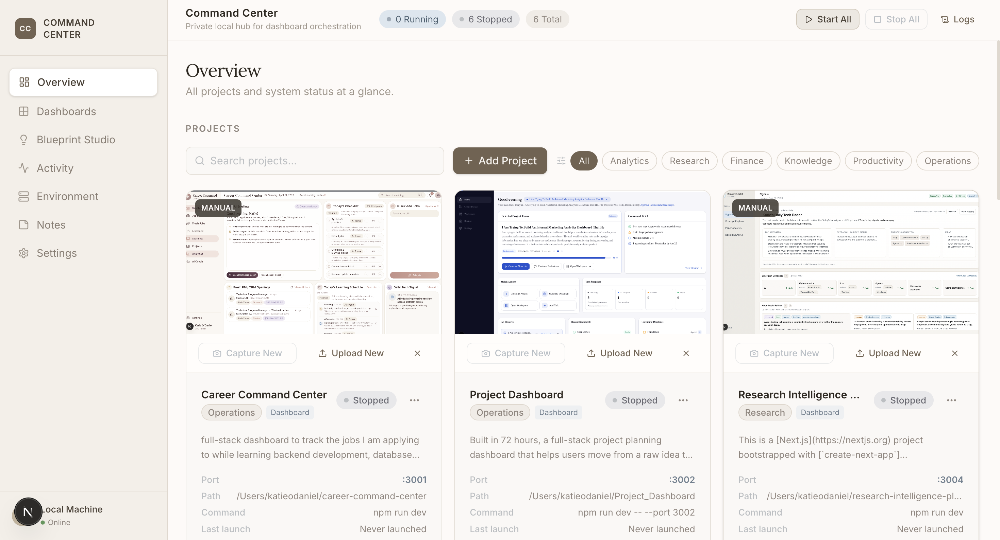
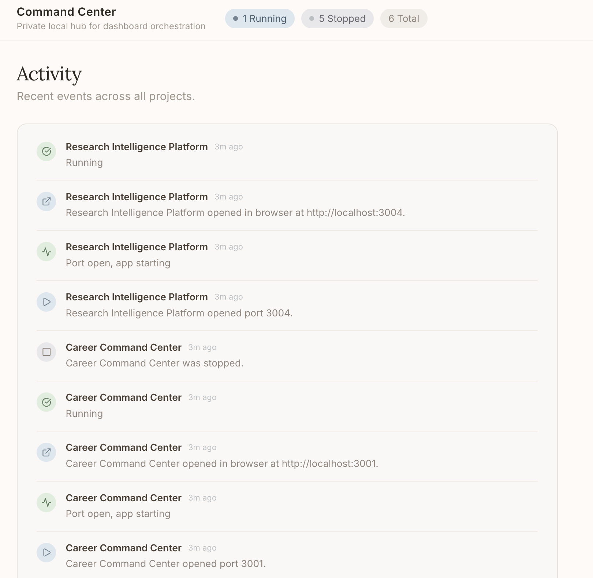
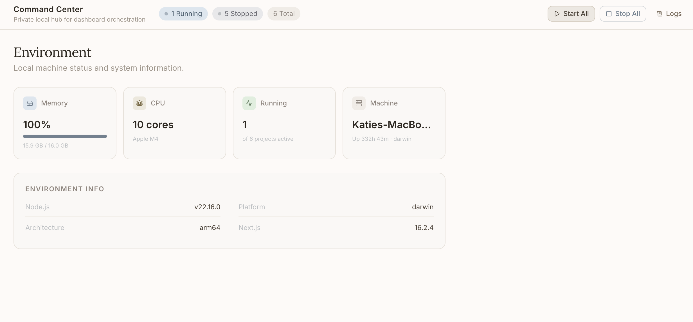
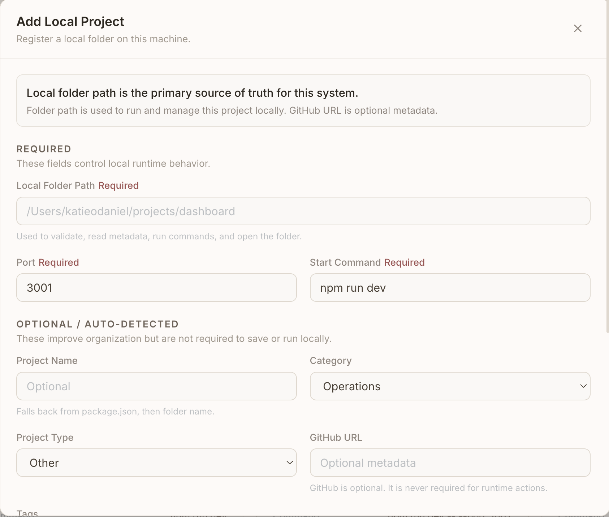
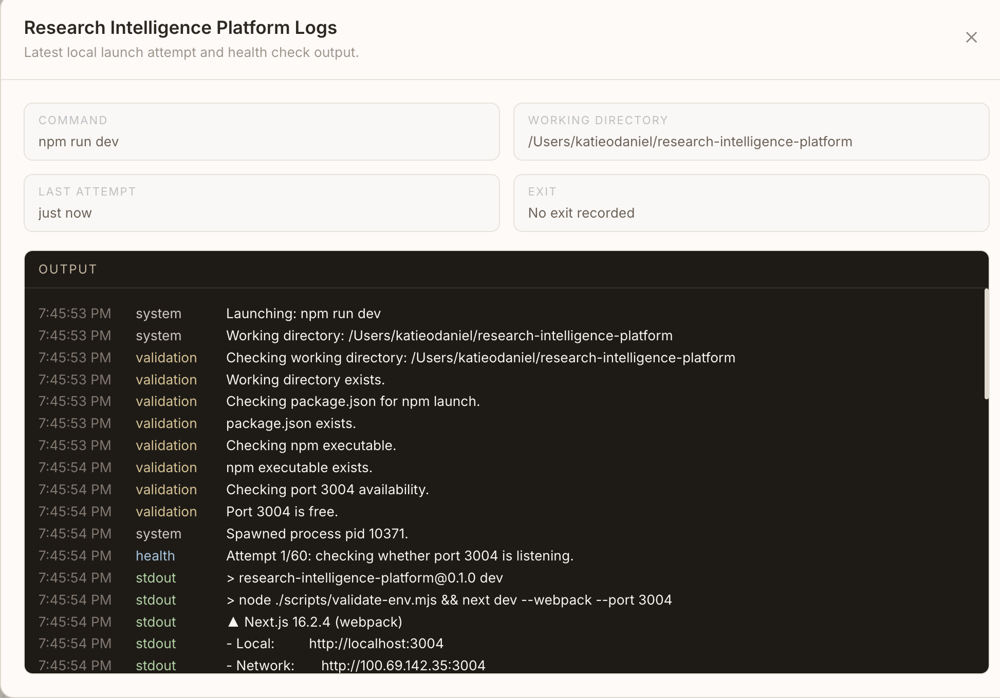
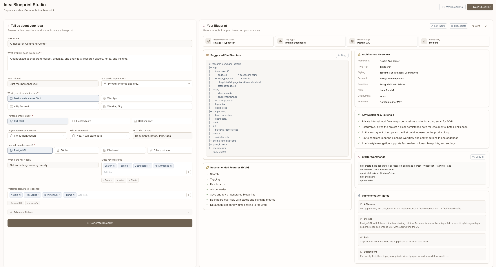
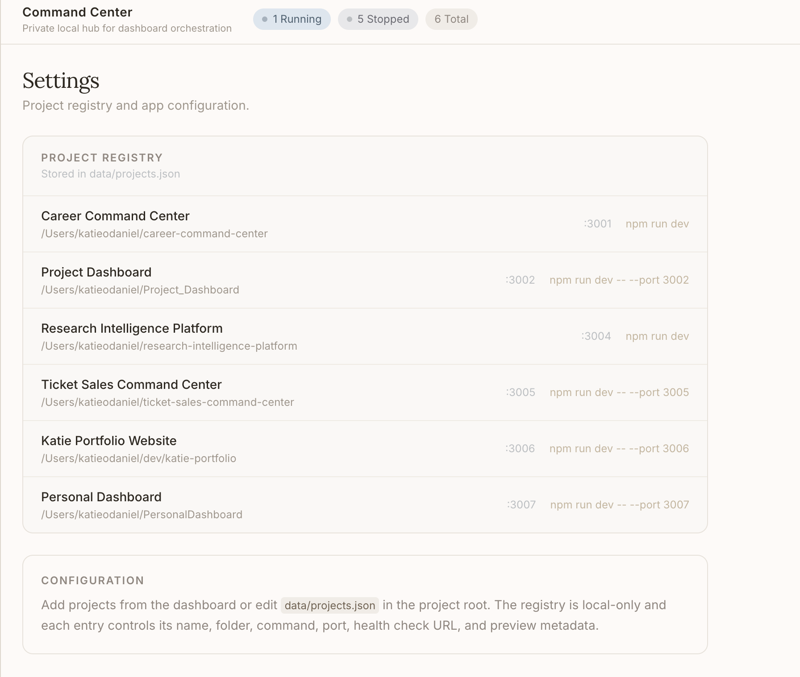
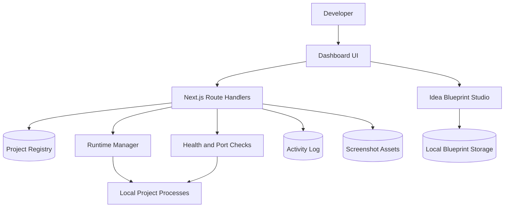

# Command Center Showcase

> A private local-operations dashboard that centralizes project launch controls, runtime visibility, screenshots, notes, activity history, and technical blueprint planning.

Command Center is a personal developer operations hub built to manage a growing collection of local projects from one focused interface. The public repository is a showcase version only: it documents the product, architecture, and engineering decisions without exposing the private application source code or reusable implementation details.

## Product Overview

Command Center turns scattered local projects into a managed workspace. Instead of remembering ports, start commands, project folders, preview screenshots, and recent activity across multiple apps, the dashboard provides a single place to register projects, launch them, inspect runtime state, capture snapshots, and keep lightweight notes.

The project also includes an Idea Blueprint Studio that converts rough product ideas into structured technical plans. This makes the tool both an operations console and a planning workspace for future builds.

## Why I Built It

I was managing multiple portfolio and experimentation projects at once, each with its own folder, port, start command, status, screenshot, and backlog context. The friction was small each time, but it compounded: finding the right folder, starting the right process, checking whether a port was available, opening a browser, and remembering project-specific notes slowed down iteration.

Command Center was built to make that workflow visible, repeatable, and easier to maintain.

## Problem It Solves

- Local projects become hard to track as the number of prototypes grows.
- Runtime state is usually spread across terminals, browser tabs, and memory.
- Screenshots and project previews are easy to lose or let go stale.
- Planning new projects often starts from an unstructured idea instead of a reusable blueprint.
- Portfolio work benefits from operational polish, but private code should stay private.

## Target Users

- Developers managing several local apps or dashboards.
- Builders maintaining a portfolio of prototypes and product experiments.
- Solo operators who want lightweight project observability without enterprise overhead.
- Recruiters and reviewers evaluating product thinking, system design, and execution quality.

## Core Features

- Project registry with name, category, framework, folder path, start command, port, tags, and repository metadata.
- Runtime controls for starting, stopping, restarting, opening, and refreshing local projects.
- Health and port checks that surface launch readiness and running state.
- Snapshot capture and manual screenshot upload for project previews.
- Activity feed for starts, stops, errors, health checks, browser opens, and snapshot updates.
- System overview cards for local machine memory, CPU, active project count, and uptime.
- Project notes for short operational context.
- Blueprint Studio for turning product ideas into architecture, feature, file-tree, and command recommendations.
- Local-first persistence appropriate for a private developer tool.

## Screenshots

## Feature Walkthrough

1. Register a local project with its folder, command, port, category, tags, and optional repository link.
2. Command Center validates the project shape and tracks whether its launch command and port look usable.
3. From the dashboard, start or restart the project without manually opening a terminal.
4. The app records runtime state, launch metadata, process output, and health events.
5. If the project is dashboard-like, the browser opens to the correct local URL after launch.
6. Capture or upload a screenshot so the project card stays visually current.
7. Use notes and activity history to retain lightweight context between sessions.
8. Use Blueprint Studio to convert future ideas into a structured build plan.

## Tech Stack

| Layer | Technology | Purpose |
| --- | --- | --- |
| Frontend | Next.js App Router, React, TypeScript | Dashboard UI, route structure, client interactions |
| Styling | Tailwind CSS, local UI primitives, Lucide icons | Responsive interface, controls, visual consistency |
| API layer | Next.js Route Handlers | Project registry actions, runtime controls, activity APIs |
| Validation | Zod | Runtime-safe input and project metadata validation |
| Process management | Node.js child process utilities | Start, stop, restart, and monitor local apps |
| Health checks | Local port and HTTP checks | Readiness and runtime status signals |
| Screenshots | Browser automation and manual uploads | Project preview capture workflow |
| Persistence | Local structured data | Private project registry, notes, metadata, and activity |

## Architecture Overview

Command Center uses a local-first architecture. The UI talks to server-side route handlers, which coordinate project metadata, runtime state, process lifecycle actions, health checks, activity logging, and screenshot handling. The system is intentionally scoped for a trusted local environment rather than multi-tenant production hosting.

## Data Flow Overview

Project actions begin in the dashboard UI. A user action calls a route handler, the route validates the project record, and the runtime layer performs the operation. Results are written back as runtime state, logs, activity events, and updated project metadata. The UI refreshes the project card and activity feed so the operator can see what changed.

Snapshot actions follow a similar pattern: the UI initiates capture or upload, the server stores a sanitized preview asset, the project record receives updated preview metadata, and the dashboard renders the new screenshot.

## AI/ML and Automation Components

The current showcase focuses on deterministic automation rather than a deployed AI service. The Idea Blueprint Studio automates early technical planning from structured inputs, producing stack guidance, architecture notes, file-tree suggestions, API route ideas, and starter commands.

The private roadmap leaves room for LLM-assisted project summarization, README generation, codebase metadata enrichment, and workflow recommendations, but no API keys, prompts, proprietary logic, or model configuration are included in this public repository.

## Engineering Highlights

- Built a local process manager that can launch and track multiple project runtimes.
- Added validation around working directories, package scripts, npm availability, ports, and health readiness.
- Modeled project data with runtime-safe schemas instead of trusting loose JSON input.
- Designed an operational UI that combines project cards, system telemetry, activity history, logs, and screenshots.
- Separated public portfolio documentation from private source code to demonstrate product quality without leaking IP.
- Designed for practical day-to-day usage: fewer terminal hops, clearer project state, and faster context recovery.

## Security, Privacy, and IP Notice

This showcase repository intentionally does not include:

- Private application source code.
- API keys, tokens, environment variables, or secrets.
- Full database schema details.
- Client data, personal data, or private project paths.
- Proprietary implementation logic.
- Runnable code that would allow someone to clone and reproduce the private app.

Screenshots should use demo data, redactions, or placeholder content.

## What I Learned

- Operational polish matters even for personal tools.
- Runtime workflows need clear validation and user feedback, not just happy-path buttons.
- Local-first tools still benefit from disciplined data modeling and activity tracking.
- Public portfolio artifacts can communicate engineering maturity without exposing private code.
- A showcase repository should explain decisions, tradeoffs, and product thinking as much as features.

## Future Improvements

- Add configurable project groups and saved views.
- Improve log filtering, search, and export.
- Add richer health-check rules per project type.
- Add dependency and environment diagnostics.
- Add safer screenshot redaction workflows.
- Expand Blueprint Studio into a reusable project planning pipeline.
- Add optional authenticated remote mode for trusted personal devices.

## Project Status

Private active project. This public repository is documentation-only and intended for portfolio review.

See the docs:

- [Case Study](docs/case-study.md)
- [Architecture](docs/architecture.md)
- [Features](docs/features.md)
- [Engineering Decisions](docs/engineering-decisions.md)
- [Future Improvements](docs/future-improvements.md)
