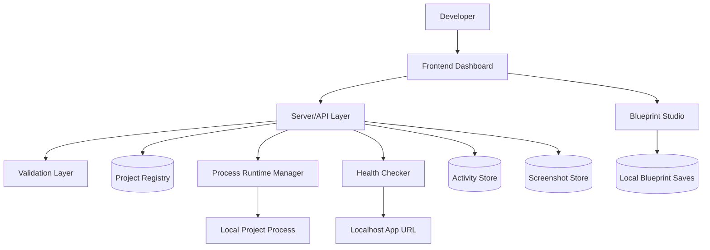

# Architecture

Command Center is a local-first developer operations dashboard. The private implementation runs as a trusted single-user app on a development machine, coordinating UI state, project metadata, process lifecycle controls, health checks, screenshots, activity events, and planning utilities.

This document describes the system at a high level without exposing private source code, exact schemas, secrets, or proprietary implementation details.

## Frontend Layer

The frontend is a Next.js and React dashboard organized around operational views:

- Overview dashboard for project cards, system status, and recent activity.
- Project card actions for launch controls, browser open, folder open, editor open, notes, screenshots, and logs.
- Activity page for historical runtime events.
- Blueprint Studio for structured product planning.
- Supporting settings, notes, and dashboard-oriented views.

The UI emphasizes scanability: status badges, compact controls, preview images, system cards, and recent event lists.

## Backend/API Layer

The backend is implemented through server-side route handlers. These endpoints coordinate operations such as:

- Reading and updating project registry metadata.
- Validating project folders, package scripts, ports, and health URLs.
- Starting, stopping, and restarting local project processes.
- Opening projects in a browser, folder, or editor.
- Recording activity events.
- Capturing or accepting screenshot uploads.
- Returning runtime logs and status.

The API layer acts as a boundary between the browser UI and privileged local operations.

## Data Layer

The private app uses local structured persistence for project metadata, notes, activity, preview metadata, and saved planning artifacts. Runtime state is held separately because process status, process IDs, and launch logs are temporary operational data.

Sensitive values such as private local paths, private project names, environment variables, and full implementation details are not included in this showcase repository.

## External APIs

The current product is primarily local-first. External integration points may include:

- Git repository metadata for branch, commit, and remote context.
- Browser or editor launch integrations.
- Optional future AI/LLM APIs for planning, summarization, and documentation support.

This showcase does not include credentials, tokens, prompts, endpoint keys, or private integration configuration.

## AI/LLM Services

Blueprint Studio currently demonstrates structured planning automation from user-provided inputs. It produces recommendations such as stack choice, architecture notes, file-tree shape, feature lists, API route ideas, and starter commands.

Future AI-assisted features could include:

- Project metadata summarization.
- README generation.
- Release note drafting.
- Error-log explanation.
- Screenshot caption suggestions.
- Project planning refinement.

Any production AI integration would require strict secret handling, cost controls, prompt privacy, and user-visible review before generated content is saved.

## Authentication and Security

The private version is designed for a trusted local development environment, not as a public multi-tenant SaaS product. Security assumptions are therefore different from a hosted app:

- Project launch actions are privileged local operations.
- The app should not be exposed publicly without authentication and authorization.
- Secrets and environment variables should remain outside the public repository.
- Screenshots should be reviewed for private paths, client names, tokens, or private data before sharing.
- Public documentation should describe behavior without exposing cloneable implementation details.

## Deployment Assumptions

The primary deployment target is local development. A future remote mode would require additional controls:

- Authentication.
- Role or device authorization.
- Network boundary hardening.
- Secret management.
- Audit logging.
- Safer process execution controls.
- More durable database-backed persistence.

## High-Level Data Flow

## Launch Flow

1. The user clicks a launch action in the dashboard.
2. The UI calls the project action endpoint.
3. The server loads the project metadata.
4. Validation checks the folder, command, package-script assumptions, and port readiness.
5. The runtime layer starts or controls the local process.
6. Health checks confirm whether the app is reachable.
7. Activity events and logs are recorded.
8. The UI refreshes runtime status and project card state.

## Screenshot Flow

1. The user captures or uploads a screenshot.
2. The server validates the asset type and source.
3. The screenshot is stored as a preview asset.
4. Project preview metadata is updated.
5. The dashboard renders the refreshed image with a timestamped cache key.

## Planning Flow

1. The user enters project constraints into Blueprint Studio.
2. The planning engine maps product type, storage needs, auth needs, stack scope, and feature goals into a structured blueprint.
3. The UI displays architecture, features, file-tree suggestions, route ideas, and setup commands.
4. Selected blueprints can be saved locally for later reference.
